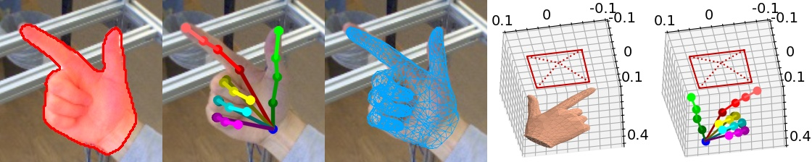

# Hand Mesh Reconstruction


## Introduction
This repo is the PyTorch implementation of hand mesh reconstruction described in [CMR](https://arxiv.org/abs/2103.02845) and [MobRecon](https://arxiv.org/abs/2112.02753).

## Update
+ 2023-11-2. Add MobRecon (SpiralConv verison) model for more robust real-world applications. If you target on freely captured images, please try `./cmr/scripts/demo_mobrecon.sh`. 
+ 2022-4-28. Wrap old-version code in `cmr`, including CMR demo/training/evaluation and Mobrecon demo/evaluation. Add `mobrecon` to release MobRecon training.
+ 2021-12-7. Add MobRecon demo.
+ 2021-6-10. Add Human3.6M dataset.
+ 2021-5-20. Add CMR-G model.

## Features
- [x] SpiralNet++
- [x] Sub-pose aggregation
- [x] Adaptive 2D-1D registration for mesh-image alignment
- [x] DenseStack for 2D encoding
- [x] Feature lifting with MapReg and PVL
- [x] DSConv as an efficient mesh operator
- [x] Complement data will be available [here](complement_data.md)
- [x] MobRecon training with consistency learning and complement data

## Install 
+ Environment
    ```
    conda create -n handmesh python=3.9
    conda activate handmesh
    ```
+ Please follow [official suggestions](https://pytorch.org/) to install pytorch and torchvision. We use pytorch=1.11.0-cuda11.3, torchvision=0.12.0
+ Requirements
    ```
    pip install -r requirements.txt
    ```
  If you have difficulty in installing `torch_sparse` etc., please follow [this link](https://pytorch-geometric.readthedocs.io/en/latest/notes/installation.html).
+ Install [MPI-IS Mesh](https://github.com/MPI-IS/mesh) from the source
+ You should accept [MANO LICENCE](https://mano.is.tue.mpg.de/license.html). Download MANO model from [official website](https://mano.is.tue.mpg.de/), then run
  ```
  ln -s /path/to/mano_v1_2/MANO_RIGHT.pkl template/MANO_RIGHT.pkl
  ```
+ Download the files you need from [Google drive](https://drive.google.com/drive/folders/1MIE0Jo01blG6RWo2trQbXlQ92tMOaLx_?usp=sharing) or [Baidu cloud](https://pan.baidu.com/s/12X1qsuxO2j8jGl6QWJdV6A?pwd=rc4x).

## Run a demo
+ Prepare pre-trained models as
  ```
  cmr/out/Human36M/cmr_g/checkpoints/cmr_pg_res18_human36m.pt
  cmr/out/FreiHAND/cmr_g/checkpoints/cmr_g_res18_moredata.pt
  cmr/out/FreiHAND/cmr_sg/checkpoints/cmr_sg_res18_freihand.pt
  cmr/out/FreiHAND/cmr_pg/checkpoints/cmr_pg_res18_freihand.pt  
  cmr/out/FreiHAND/mobrecon_spconv/checkpoints/mobrecon_densestack.pt  
  ``` 
+ Run
  ```
  ./cmr/scripts/demo_cmr.sh
  ./cmr/scripts/demo_mobrecon.sh
  ```
  The prediction results will be saved in output directory, e.g., `out/FreiHAND/mobrecon/demo`.

+  Explaination of the output

    <p align="middle">  
      
    </p> 

    + In an JPEG file (e.g., 000_plot.jpg), we show silhouette, 2D pose, projection of mesh, camera-space mesh and pose
    + As for camera-space information, we use a red rectangle to indicate the camera position, or the image plane. The unit is meter.
    + If you run the demo, you can also obtain a PLY file (e.g., 000_mesh.ply). 
        + This file is a 3D model of the hand.
        + You can open it with corresponding software (e.g., Preview in Mac).
        + Here, you can get more 3D details through rotation and zoom in.

## Dataset
#### FreiHAND
+ Please download FreiHAND dataset from [this link](https://lmb.informatik.uni-freiburg.de/projects/freihand/), and create a soft link in `data`, i.e., `data/FreiHAND`.
+ Download mesh GT file `freihand_train_mesh.zip`, and unzip it under `data/FreiHAND/training`
#### Human3.6M
+ The official data is now not avaliable. Please follow [I2L repo](https://github.com/mks0601/I2L-MeshNet_RELEASE) to download it.
+ Download silhouette GT file `h36m_mask.zip`, and unzip it under `data/Human36M`.
#### Real World Testset
+ Please download the dataset from [this link](https://github.com/3d-hand-shape/hand-graph-cnn/tree/master/data/real_world_testset), and create a soft link in `data`, i.e., `data/Ge`.
#### Complement data
+ See [this file](complement_data.md) for complement data. Then, create a soft link in `data`, i.e., `data/CompHand`.

#### Data dir
```  
${ROOT}  
|-- data  
|   |-- FreiHAND
|   |   |-- training
|   |   |   |-- rgb
|   |   |   |-- mask
|   |   |   |-- mesh
|   |   |-- evaluation
|   |   |   |-- rgb
|   |   |-- evaluation_K.json
|   |   |-- evaluation_scals.json
|   |   |-- training_K.json
|   |   |-- training_mano.json
|   |   |-- training_xyz.json
|   |-- Human3.6M
|   |   |-- images
|   |   |-- mask
|   |   |-- annotations
|   |   |-- J_regressor_h36m_correct.npy
|   |-- Ge
|   |   |-- images
|   |   |-- params.mat
|   |   |-- pose_gt.mat
|   |-- Compdata
|   |   |-- base_pose
|   |   |-- trans_pose_batch1
|   |   |-- trans_pose_batch2
|   |   |-- trans_pose_batch3
```  

## Evaluation
#### FreiHAND
```
./cmr/scripts/eval_cmr_freihand.sh
./cmr/scripts/eval_mobrecon_freihand.sh
```
+ JSON file will be saved as `out/FreiHAND/cmr_sg/cmr_sg.json`. You can submmit this file to the [official server](https://competitions.codalab.org/competitions/21238) for evaluation.

#### Human3.6M
```
./cmr/scripts/eval_cmr_human36m.sh
```
#### Performance on PA-MPJPE (mm)
We re-produce the following results after code re-organization.

|  Model / Dataset   | FreiHAND  | Human3.6M (w/o COCO) |
|  :----:  | :----:  |:----:  |
| CMR-G-ResNet18   | 7.6 | - |
| CMR-SG-ResNet18  | 7.5 | - |
| CMR-PG-ResNet18  | 7.5 | 50.0 |
| MobRecon-DenseStack  | 6.9 | - |

## Training
```
./cmr/scripts/train_cmr_freihand.sh
./cmr/scripts/train_cmr_human36m.sh
./mobrecon/scripts/train_mobrecon.sh
```
A experiment log will be saved under `cmr/out` or `mobrecon/out`
## Reference
```tex
@inproceedings{bib:CMR,
  title={Camera-Space Hand Mesh Recovery via Semantic Aggregationand Adaptive 2D-1D Registration},
  author={Chen, Xingyu and Liu, Yufeng and Ma, Chongyang and Chang, Jianlong and Wang, Huayan and Chen, Tian and Guo, Xiaoyan and Wan, Pengfei and Zheng, Wen},
  booktitle={Proceedings of the IEEE/CVF Conference on Computer Vision and Pattern Recognition (CVPR)},
  year={2021}
}
@inproceedings{bib:MobRecon,
  title={MobRecon: Mobile-Friendly Hand Mesh Reconstruction from Monocular Image},
  author={Chen, Xingyu and Liu, Yufeng and Dong Yajiao and Zhang, Xiong and Ma, Chongyang and Xiong, Yanmin and Zhang, Yuan and Guo, Xiaoyan},
  booktitle={Proceedings of the IEEE/CVF Conference on Computer Vision and Pattern Recognition (CVPR)},
  year={2022}
}
```

## Acknowledgement
Our implementation of SpiralConv is based on [spiralnet_plus](https://github.com/sw-gong/spiralnet_plus?utm_source=catalyzex.com).

We also thank [hand-graph-cnn](https://github.com/3d-hand-shape/hand-graph-cnn/tree/master/data), [I2L-MeshNet_RELEASE](https://github.com/mks0601/I2L-MeshNet_RELEASE), [detectron2](https://github.com/facebookresearch/detectron2), smplpytorch(https://github.com/gulvarol/smplpytorch) for inspiring implementations.
