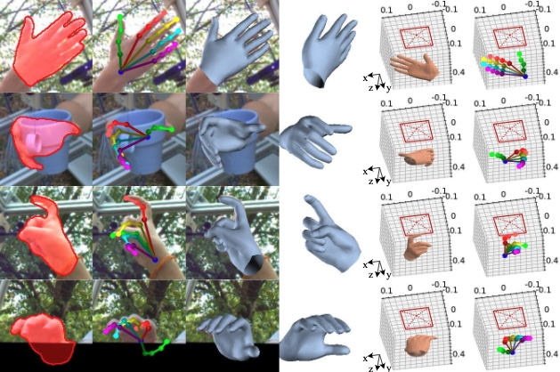

# Camera-Space Hand Mesh Recovery via Semantic Aggregation and Adaptive 2D-1D Registration

<p align="center">
  
<p align="center">

<p align="center">

</p>

## Introduction
This repo is the PyTorch implementation of CVPR2021 paper "Camera-Space Hand Mesh Recovery via Semantic Aggregationand Adaptive 2D-1D Registration". You can find this paper from [this link](https://arxiv.org/pdf/2103.02845.pdf).

## Install 
+ Environment
    ```
    conda create -n CMR python=3.6
    conda activate CMR
    ```
+ Please follow [official suggestions](https://pytorch.org/) to install pytorch and torchvision. We use pytorch=1.5.0, torchvision=0.6.0
+ Requirements
    ```
    pip install -r requirements.txt
    ```
  If you have difficulty in installing `torch_sparse` etc., please use `whl` file from [here](https://pytorch-geometric.com/whl/).
+ [MPI-IS Mesh](https://github.com/MPI-IS/mesh): We suggest to install this library from the source 

+ Download the pretrained model for [CMR-SG](https://drive.google.com/file/d/1xOzLlOGR8m6Q2Nh74Jiwd8CSVEMaKa3H/view?usp=sharing) or [CMR-PG](https://drive.google.com/file/d/1Lfz2Tjo8opjCZbcmyIYhqQcGwhasIsvp/view)
  and place it at 
  ```
  out/FreiHAND/cmr_sg/checkpoints/cmr_sg_res18_freihand.pt
  out/FreiHAND/cmr_pg/checkpoints/cmr_pg_res18_freihand.pt
  ``` 


## Run a demo
```
./scripts/demo.sh
```
The prediction results will be saved in `out/FreiHAND/cmr_pg/demo` 

## Dataset
#### FreiHAND
+ Please download FreiHAND dataset from [this link](https://lmb.informatik.uni-freiburg.de/projects/freihand/), and create a soft link in `data`, i.e., `data/FreiHAND`.
+ Downdownload mesh GT file form [this link](https://drive.google.com/file/d/1hutsbecc0eFWZFvPclBso9IfYWcVM3iF/view?usp=sharing), and unzip it under `data/FreiHAND/training`
```  
${ROOT}  
|-- data  
|   |-- FreiHAND
|   |   |-- training
|   |   |   |-- rgb
|   |   |   |-- mask
|   |   |   |-- mesh
|   |   |-- evaluation
|   |   |   |-- anno
|   |   |   |-- rgb
|   |   |-- evaluation_K.json
|   |   |-- evaluation_scals.json
|   |   |-- training_K.json
|   |   |-- training_mano.json
|   |   |-- training_xyz.json
```  

## Evaluation
```
./scripts/eval_freihand.sh
```
+ JSON file will be saved as `out/FreiHAND/cmr_sg/cmr_sg.josn`. You can submmit this file to the [official server](https://competitions.codalab.org/competitions/21238) for evaluation.
+ If you want to save prediction results like above demo, you would want to uncomment Line 170 in `run.py`. The prediction results will be saved in `out/FreiHAND/cmr_sg/eval`.

## Explaination of the output

<p align="middle">  
  
</p> 

+ In an JPEG file (e.g., 000_plot.jpg), we show silhouette, 2D pose, projection of mesh, camera-space mesh and pose
+ As for camera-space information, we use a red rectangle to indicate the camera position, or the image plane. The unit is meter.
+ If you run the demo, you can also obtain a PLY file (e.g., 000_mesh.ply). 
    + This file is a 3D model of the hand.
    + You can open it with corresponding software (e.g., Preview in Mac).
    + Here, you can get more 3D details through rotation and zoom in.

## Training
```
./scripts/train_freihand.sh
```
## Reference
```tex
@inproceedings{bib:CMR,
  title={Camera-Space Hand Mesh Recovery via Semantic Aggregationand Adaptive 2D-1D Registration},
  author={Chen, Xingyu and Liu, Yufeng and Ma, Chongyang and Chang, Jianlong and Wang, Huayan and Chen, Tian and Guo, Xiaoyan and Wan, Pengfei and Zheng, Wen},
  booktitle={Proceedings of the IEEE/CVF Conference on Computer Vision and Pattern Recognition (CVPR)},
  year={2021}
}
```

## Acknowledgement
Our implementation of SpiralConv is based on [spiralnet_plus](https://github.com/sw-gong/spiralnet_plus?utm_source=catalyzex.com).
